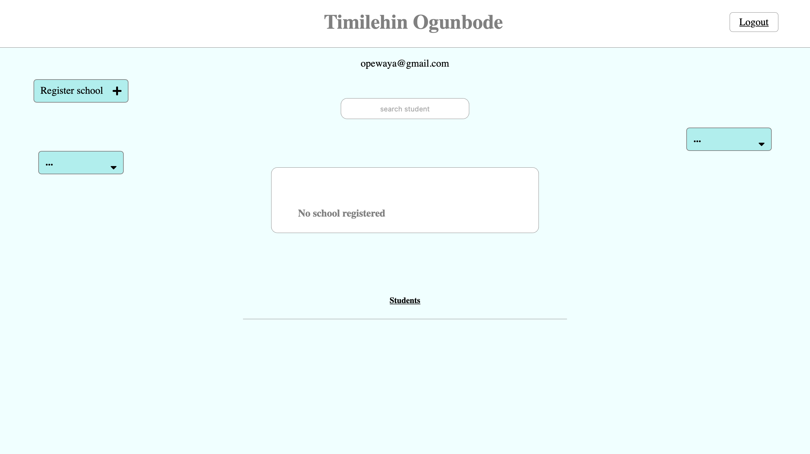
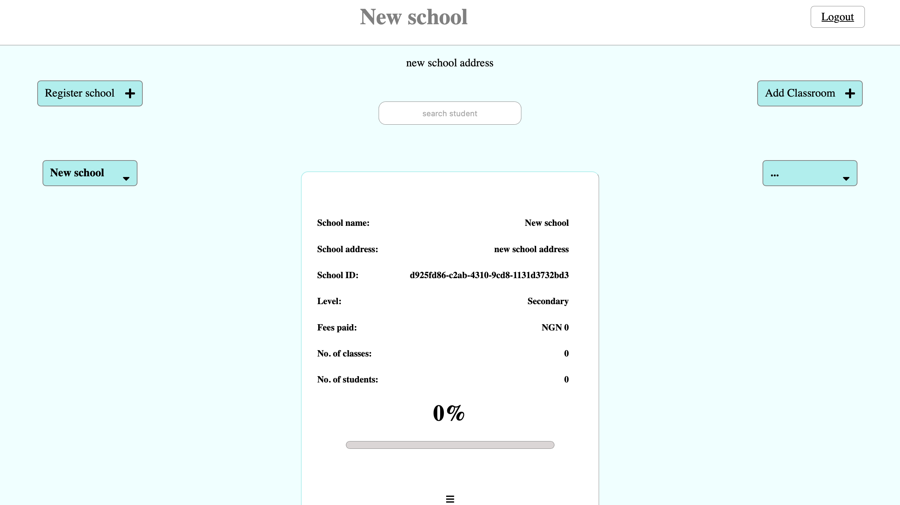
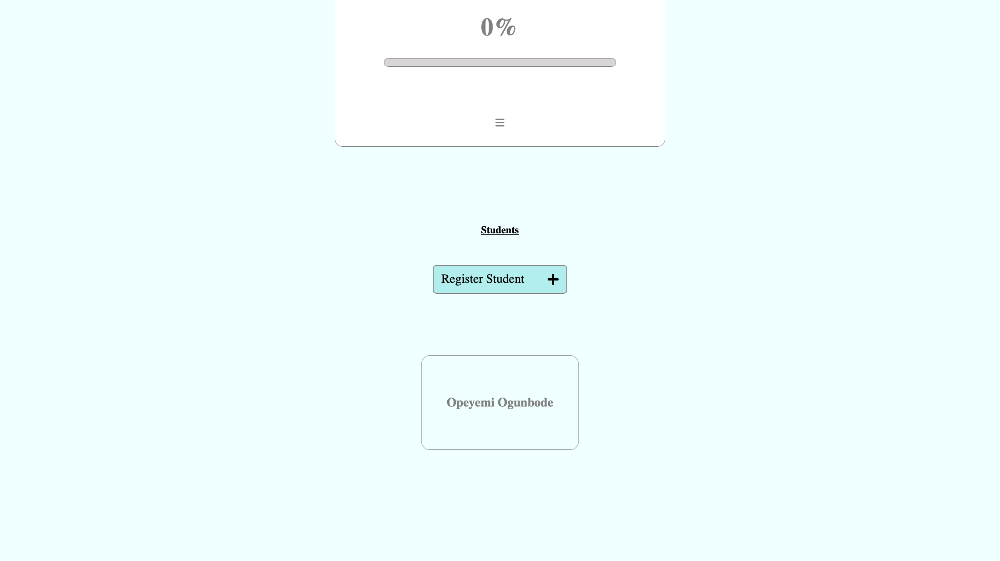
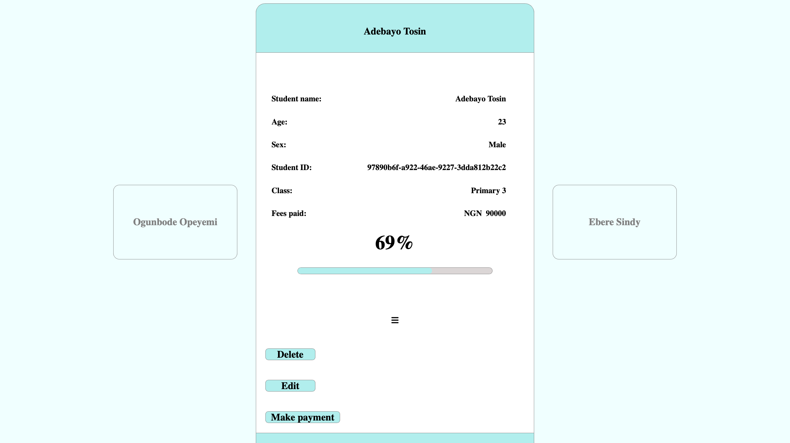

<h1>School Fees Manager<h1>

<h2>Introduction</h2>

This is a project that looks to solve the problem of fees management for school Administrators.
 It helps to monitor the payment progress of each child in the school. Now this is great 
because from the comfort from your home or office you can easily track payment progress 
and have accurate data of cash inflow into the school account. Also you get to manage different
branches of your school if you have more than one branch.

You get to create Add a new school, class and student from your dashboard.

<a href="https://roadsidedev.tech/feesmanager">Deployed application</a>

<a href="https://medium.com/@ogunbodetimi/fees-manager-b002c00cfd26">Project blog post</a>

<h3>Developer</h3>
  
Ogunbode Opeyemi

  
<a href="www.linkedin.com/in/opeyemi-ogunbode-33441814a">LinkedIn</a>

<h2>Built with</h2>
    <ul>
        <li>Python -> Primary Language for logic implememntation.</li>
        <li>Python Flask -> As the backend framework.</li>
        <li>Javascript/HTML/CSS -> Frontend rendering and dynamic contents.</li>
        <li>MySQL -> Database storage.</li>
        <li>SQLAlchemy -> ORM for data storage.</li>
        <li>bcrypt -> password hashing</li>
        <li>Git -> Version control.</li>
    </ul>

<h2>Getting started</h2>
  

    <h3>Dependencies</h3>
        <ul>
            <li>Python 3.9.10 -> [$ sudo apt-get install python3] (for Linux os)</li>
            <li>flask -> [$ pip install flask]</li>
            <li>flask_login -> [$ pip install flask-login]</li>
            <li>MySQL</li>
            <li>SQLAlchemy -> [$ pip install flask-sqlalchemy]</li>
            <li>bcrypt -> [$ pip install bcrypt]</li>
        </ul>
    <h3>Installing</h3>
        
Simply fork this repository to your local machine

  

<h2>Execute Program</h2>
    
You will need to firstly create a mysql database on your local machine. 
    If you are using a non-root user to access the database, be sure to 
    grant all privileges to this user on that database.
    Now to run the command, the following environmanetal variabes should be set;

    <ul>
        <li>FEES_MAN_USER -> This should be set to the database user</li>
        <li>FEES_MAN_PASSWORD -> This should be set to the password associated with 
          the database user</li>
        <li>FEES_MAN_HOST -> This should be set to Localhost if your database is 
          hosted on your local machine. Else specify the ip address for your database.</li>
        <li>FEES_MAN_DBNAME -> This should be set to the name for the database you created 
          earlier</li>
        <li>FEES_SECRET_KEY -> Set this secret key to whatever you like but be sure to keep it
          consistent.</li>
        <li>FLASK_APP -> Set this to "api/v1/app"</li>
    
Finally you can run the command "flask run" in your terminal. Be sure to run it from the 
    projects root directory.

    
Example:

        
FEES_MAN_USER=myuser FEES_MAN_PASSWORD=mypwd FEES_MAN_HOST=localhost FEES_MAN_DBNAME=mydb FEES_MAN_SECRET_KEY=mysecretkey FLASK_APP=api/v1/app flask run

    
<h2>Usage</h2>
    
Now that you have your server running, go to your browser and type "http://127.0.0.1:5000/signup".
    This would take you to a signup page which would create an account for you to have a user experience.
    Next you login and you can now create a school, class or student.

    
To create a school, click on the "Register school" button at the top left of the school.
    An admin password is required for every create, edit and delete operation.
 
    

    
This step is required to create a classroom or a student.

    
To register a student, a class has to be created to place the student in so create a class and 
    you can now register a student

    

    
To register a student, click on "students" at the bottom of the page and click register student

    

    

    
As seen here, different actions can be taken by the administrator under the student view. You can delete or edit student information and most importantly, you can log a payment for a student.

<h2>Contribution</h2>
  <h5>The "fork-and-pull" Git workflow should be followed for any contributions.</h5>
    <ul>
      <li>Fork this repository on GitHub</li>
      <li>Clone the project to your local machine</li>
      <li>Commit changes made to your own separate branch</li>
      <li>Push your changes back to your fork</li>
      <li>Make a Pull request so your changes can be reviewed</li>
    </ul>
    
Always merge the latest from "upstream" before making any pull request! to maintain consistency

<h2>Licensing</h2>

  
MIT License

  
Copyright (c) 2022 Timi-T

  
Permission is hereby granted, free of charge, to any person obtaining a copy
    of this software and associated documentation files (the "Software"), to deal
    in the Software without restriction, including without limitation the rights
    to use, copy, modify, merge, publish, distribute, sublicense, and/or sell
    copies of the Software, and to permit persons to whom the Software is
    furnished to do so, subject to the following conditions:

  
The above copyright notice and this permission notice shall be included in all
    copies or substantial portions of the Software.

  
THE SOFTWARE IS PROVIDED "AS IS", WITHOUT WARRANTY OF ANY KIND, EXPRESS OR
    IMPLIED, INCLUDING BUT NOT LIMITED TO THE WARRANTIES OF MERCHANTABILITY,
    FITNESS FOR A PARTICULAR PURPOSE AND NONINFRINGEMENT. IN NO EVENT SHALL THE
    AUTHORS OR COPYRIGHT HOLDERS BE LIABLE FOR ANY CLAIM, DAMAGES OR OTHER
    LIABILITY, WHETHER IN AN ACTION OF CONTRACT, TORT OR OTHERWISE, ARISING FROM,
    OUT OF OR IN CONNECTION WITH THE SOFTWARE OR THE USE OR OTHER DEALINGS IN THE
    SOFTWARE.

